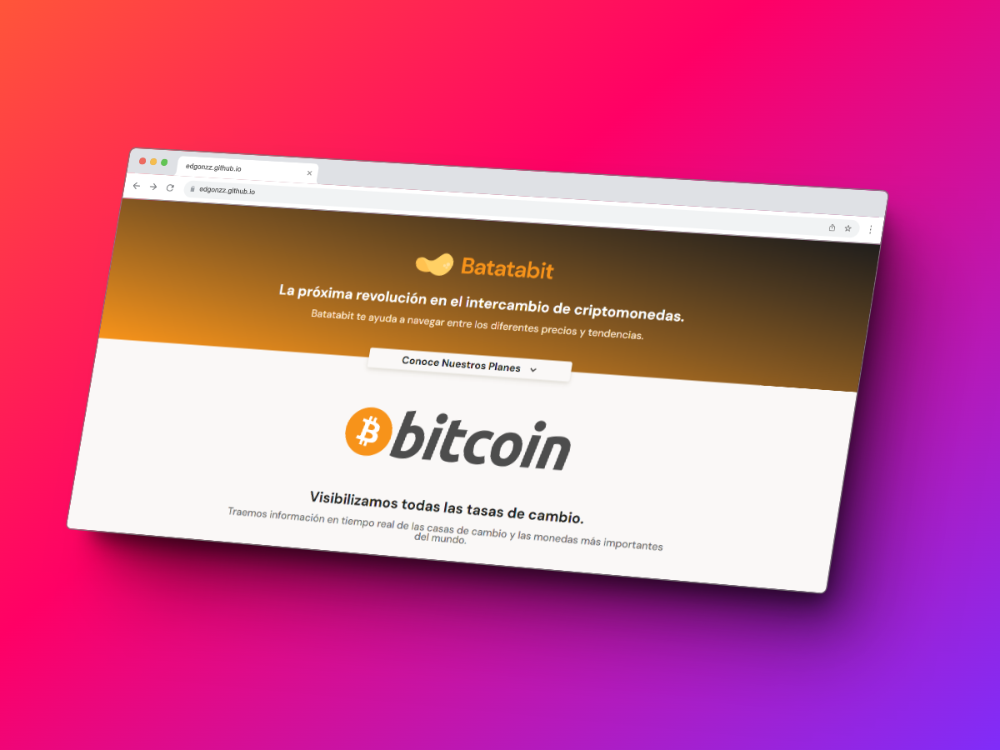
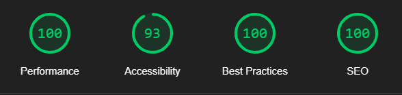

# Batatabit 

Batatabit es un proyecto que creamos en el <a href="https://platzi.com/cursos/mobile-first/" target="_blank">Curso de Responsive Design: Maquetación Mobile First</a> en **Platzi**, en cual aprendimos la importancia en realizar primero el diseño mobile y después realizar la adaptación a diferentes dispositivos.

En este curso también fundamentamos lo aprendido en el curso de <a href="https://platzi.com/cursos/html-css/" target="_blank">Curso Definitivo de HTML y CSS</a>

## Mejoras

En este proyecto me tome la libertad de cambiar algunas cosas como:

* Mejore el diseño de la landing page.
* Optimice todos los recursos.
* Opte por mejorar la semántica del HTML.
* Utilice la metodología de BEM para ahorrar lineas de código en mi CSS.
* Optimice el SEO y Cree los Open Graph para compartir el link.

Aqui esta la <a href="https://edgonzz.github.io/curso-mobile-first/" target="_blank">Demo</a>